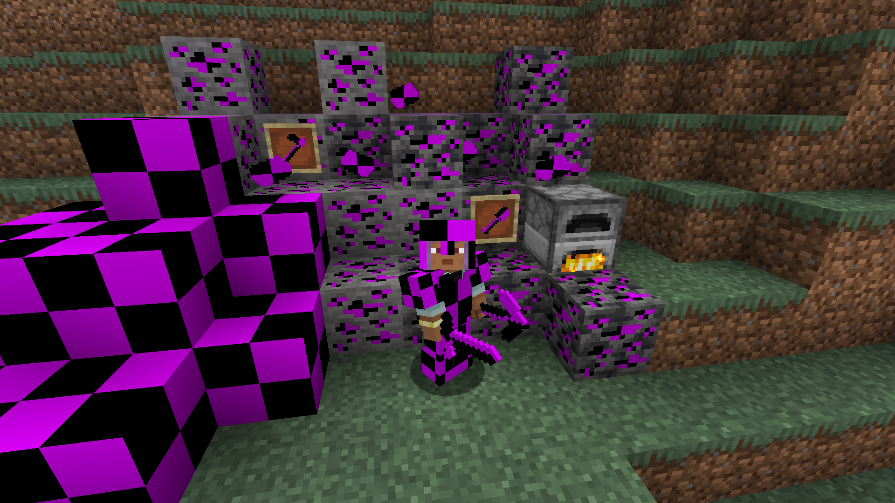

# uselessmod

## contents
- [mod features](#features)
   - [useless ore](#useless-ore-image)
   - [raw uselessness](#raw-uselessness-image)
   - [uselessness](#uselessness-image)
   - [useless block](#useless-block-image)
   - [armor](#armor)
- [supported languages](#languages-supported)
- [how to install](#how-to-install)
- [source installation information for modders (if you want to run the mod with using gradle)](#source-installation-information-for-modders)

## features

### useless ore 

how to find:
- can be found in caves

use:
- when mined gives: [raw uselessness](#raw-uselessness-image)

### raw uselessness 
how to get:
- get by mining [useless ore](#useless-ore-image)

use:
- when smelt in furnace gives: [uselessness](#uselessness-image)

### uselessness 
useless item
how to get:
- smelt [raw uselessness](#raw-uselessness-image)

use:
- can be crafted into: [useless block](#useless-block-image)
- can be crafted into: [armor](#armor)

### useless block 
how to get:
- craft from [uselessness](#uselessness-image)

### armor
armor sets:
- useless armor (crafted with: [uselessness](#uselessness-image))

all armor pieces:
- useless helmet 
- useless chestplate 
- useless leggings 
- useless boots 

### tools
**WORK IN PROGRESS!!!**

tool types:
- useless tools (crafted with: [uselessness](#uselessness-image))

all tools:
- useless sword 
- useless pickaxe 
- useless axe 
- useless shovel 
- useless hoe 

## languages supported

- english
- finnish

## how to install

watch a [tutorial](https://www.youtube.com/watch?v=_mmgsdCxASo) or follow these steps

- download from the [latest release](https://github.com/beeppi/uselessmod-1.20/releases/latest) the .jar file
- it's also a good idea to press the **what is in the mod** link to see what is in the version you're downloading
- download [forge 1.20](https://files.minecraftforge.net/net/minecraftforge/forge/index_1.20.html) installer (if you don't have it already)
- run the installer
- open file explorer and go to %appdata% > .minecraft > mods and put the .jar file in the forder
- open minecraft launcher
- run the forge installation or create a new forge installation yourself
- press play

## Source installation information for modders

This code follows the Minecraft Forge installation methodology. It will apply
some small patches to the vanilla MCP source code, giving you and it access 
to some of the data and functions you need to build a successful mod.
Note also that the patches are built against "un-renamed" MCP source code (aka
SRG Names) - this means that you will not be able to read them directly against
normal code.
Setup Process:

Step 1: Open your command-line and browse to the folder where you extracted the zip file.
Step 2: You're left with a choice.
If you prefer to use Eclipse:
1. Run the following command: `gradlew genEclipseRuns` (`./gradlew genEclipseRuns` if you are on Mac/Linux)
2. Open Eclipse, Import > Existing Gradle Project > Select Folder 
   or run `gradlew eclipse` to generate the project.
If you prefer to use IntelliJ:
1. Open IDEA, and import project.
2. Select your build.gradle file and have it import.
3. Run the following command: `gradlew genIntellijRuns` (`./gradlew genIntellijRuns` if you are on Mac/Linux)
4. Refresh the Gradle Project in IDEA if required.
If at any point you are missing libraries in your IDE, or you've run into problems you can 
run `gradlew --refresh-dependencies` to refresh the local cache. `gradlew clean` to reset everything 
{this does not affect your code} and then start the process again.
Mapping Names:

=============================

By default, the MDK is configured to use the official mapping names from Mojang for methods and fields 
in the Minecraft codebase. These names are covered by a specific license. All modders should be aware of this
license, if you do not agree with it you can change your mapping names to other crowdsourced names in your 
build.gradle. For the latest license text, refer to the mapping file itself, or the reference copy here:
https://github.com/MinecraftForge/MCPConfig/blob/master/Mojang.md
Additional Resources: 

=========================

Community Documentation: https://mcforge.readthedocs.io/en/latest/gettingstarted/  
LexManos' Install Video: https://www.youtube.com/watch?v=8VEdtQLuLO0  
Forge Forum: https://forums.minecraftforge.net/  
Forge Discord: https://discord.gg/UvedJ9m 
